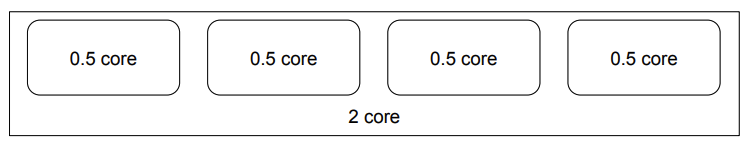
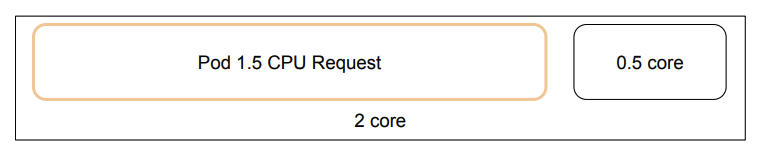
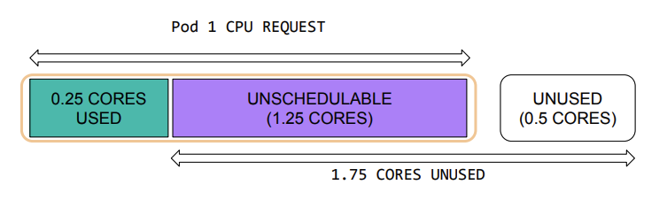

Practical tips for rightsizing your Kubernetes workloads
===

https://www.datadoghq.com/blog/rightsize-kubernetes-workloads/

コンテナとコンテナオーケストレーションの導入により、CPU/Memory が効率的に活用できる可能性が広がった。しぱし、クラウド料金が下がらず、むしろ料金が増加しているケースも多い。
[2020年の調査](https://www.datadoghq.com/container-report-2020/#3)では、約 50% のコンテナが要求された CPU/Memory の 1/3 未満を使用していることがわかった。つまり、多くの組織が最終的に使用していないリソースに対して料金を支払っている。

## Kubernetes スケジューラ

Kubernetes scheduler は、クラスタ内のどこに Pod を配置するかを決定する際、 Pod のリソースリクエストを考慮する。例えば、コンテナの要求を満たすのに十分なリソースが無いノードには Pod をスケジュールしない。

1 つの Node に 2 つの CPU コアがある状況を考える。

ここに、1.5 コアのコンテナを作成すると、Kubernetes スケジューラは十分なリソースを持つノードを選択し、リソースを予約する。

この状況では、0.5 コア未満の Pod がクラスタにデプロイされるまで使用されることはない。
一方で、この Pod が実際に使用するリソースは 0.5 コアであった場合、1.5 コアスケジュール不可能な CPU リソースが生まれる事になる。

これにより、最終的にはより多くの/大きなノードが必要となり、コストが増加する。
このため、コンテナに対して適切な量の CPU と Memory を割り当てることは、コストを削減するために重要である。

## 適切なサイジング
### 新しいサービスのリソース要件を見積もる

初めて運用環境にデプロイされる新しいサービスの場合、実際の運用で必要となるリソース量を見積もることは難しい。

このような場合、最初のステップではアプリケーションコードに基づいてサンプル入力でベンチマークを行うことである。この取り組みに最適な人災はサービス開発をしている人である。

最初はコンポーネントごとにベンチマークを行い、その後、e2e でのベンチマークを行う。事前に大まかな予測を立てることで、ビジネス目標を達成することに役立つ場合がある。例えば、パフォーマンスが悪い場合サービスのコストが高くなりすぎる可能性がある。

この最初のリソース推定は、サービスに必要と思われる以上の量をリクエストすることがよい。必要以上に少ない CPU はスロットリングを起こし、少ない Memory は OOM を引き起こす可能性がある。

### リソース最適化
#### Kubernetes Vertial Pod Autoscaler
[Vertical Pod Autoscaler](https://github.com/kubernetes/autoscaler/tree/master/vertical-pod-autoscaler) (VPA) は、CPU と Memory の使用状況のメトリクスを収集し、そのデータから CPU と Memory の適切な値を推奨/設定できる。

しかし、VPA は過去の metrics から将来のリソース使用量を予測するため、CPU や Memoroy の使用率が安定しているワークロードには機能するが、使用率が定期的に急増、 低下するようなワークロードにはうまく機能しない。これは自分で recommender を実装すれば回避できる可能性がある。

また、 VPA は Horizontal Pod Autoscaler(HPA) の CPU, Memory スケーリングとの併用は推奨されておらず、External Metrics によるスケーリングのみ併用可能である[^vpa-limitation]。

Google Kubernetes Engine(GKE) では、[Multi Pod Autoscaler](https://cloud.google.com/kubernetes-engine/docs/how-to/multidimensional-pod-autoscaling) という機能があり、これは、VPA と HPA を併用することで、CPU, Memory 両方のスケーリングを行うことができる。
これの OSS 版として、2024/01/16 現在、[AEP-5342: Multi-dimensional Pod Autoscaler](https://github.com/kubernetes/autoscaler/blob/master/multidimensional-pod-autoscaler/AEP.md) が提案されている[^multi-dimensional-pod-ausoscaler]。

[2023年の Datadog による調査](https://www.datadoghq.com/container-report/) では、VPA を導入している企業は顧客の 1% 程度であり、2021 年の調査と比較して横ばいである[^datadog-vpa-report] 。

#### CPU limit
CPU limit はコンテナが使用できる CPU 時間の上限を設定する。ノード上でスケジュールされたすべてのコンテナの CPU request の合計がノードの容量を超えることはなく、ノードの使用率に関わらず、平均すると常に request した量の CPU が得られる。

CPU limit が制限されていない Pod 2 つ同じノードに配置され、request した以上の CPU を使う場合、CPU request が大きい Pod の方により多くの CPU 時間が割り当てられ、request が小さい Pod はすロットリングされる。

#### Memory limit
CPU とは異なり、Memory は圧縮不可能なリソースである。コンテナが request したメモリが不十分な場合や、コンテナの limit を超えた場合、そのプロセスはカーネルによって強制終了される（Out of Memory/OOM)。
実際の使用量より十分に大きな同じ値の request と limit を同時に設定すると、オーバーコミットによる OOM が発生しなくなる。

### ワークロードの性質を考慮する
これらの推奨事項は、クラウドコストとパフォーマンスのバランスを取るための一般的なガイドラインである。
例えば、要件がコストだけの場合、 CPU と Memory の使用率を低いパーセンタイル（p75 など）に設定する場合がある。同様にパフォーマンスの最大化が要件の場合、より高いパーセンタイル（p99) が使用できる。

# Reference
[^vpa-limitation]: https://github.com/kubernetes/autoscaler/tree/master/vertical-pod-autoscaler#known-limitations
[^multi-dimensional-pod-ausoscaler]: https://github.com/kubernetes/autoscaler/pull/5999
[^datadog-vpa-report]: https://www.datadoghq.com/container-report/#5
